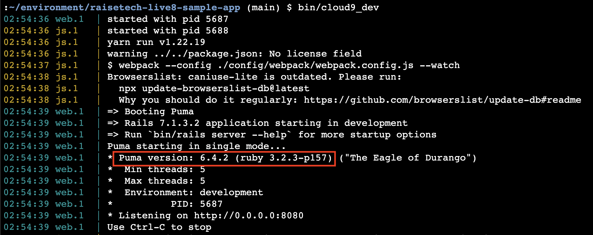

## APサーバー
 - サーバー名：Puma
 - バージョン：6.4.2
 
 - APサーバーを終了する
 
 - Pumaを停止した状態でアプリケーション実行したときのブラウザ表示
 
 - Pumaを起動した状態でアプリケーション実行したときのブラウザ表示
 
## DBサーバー
 - サーバー名：mysql
 - バージョン：8.4.2
 
 - MySQLを停止した状態でアプリケーションを実行したときのブラウザ表示
 
## 第３回講義から学んだこと
1. Webアプリケーションの全体像
 - クライアントPCはWebブラウザを通じてサーバー（サービス提供者）にアクセスする
 - サーバーは主にWebサーバー、アプリケーションサーバー、データベースで構築されている
 - クライアントからのHTTPリクエストをWebサーバーが受け取り、静的コンテンツの配信を担当する
 - 動的なコンテンツが必要な場合はリクエストをアプリケーションサーバーに転送する
 - リクエストを受け取ったアプリケーションサーバーはWebアプリケーションを実行する
 - WebサーバーにはApacheやNginxなどがあり、アプリケーションサーバーにはPumaやUnicorn、PHP-FPMがある
 - Pumaは内部的にWebサーバーの機能を持っているため、単体でWebアプリを起動させることも可能
 - 本番環境では、追加の機能や最適化のためにNginxなどのWebサーバーと組み合わせて使用することが多い
2. bit/setupの役割
 - Railsアプリケーションの初期セットアップを効率的に行うためのコマンド。依存関係の確認やデータベースの準備、不要ファイルの削除、サーバーの再起動などの一連の作業を自動化し、開発環境を構築する
3. MySQLについて
 - セキュリティ的にはrootユーザーではなく、新規ユーザーを作成するのが望ましい
 - 停止コマンド `sudo systemctl stop mysqld`
 - 起動コマンド `sudo systemctl start mysqld`
4. bundler installについて
 - Gemfileに記述されたgemとそのバージョン指定を読み取る
 - 依存関係や一貫性の確保をしてくれるので、依存関係の管理が容易になる

## 感じたこと
 - エラーメッセージをよく読み解くこと
 - gemなど様々なソフトウェアのインストールのためにコマンドの実行が必要だが、その都度調べれば問題ないので、覚える必要はない（もちろん覚えたほうが効率性は上がる）
 - AWSと同様、rootユーザーでログイン、操作を行うことはセキュリティ上好ましくないので気をつけたい
 - 基本的なWebアプリケーションの構造や各部の役割を知っておくことで、エラーメッセージを読み解きやすくなると感じた
